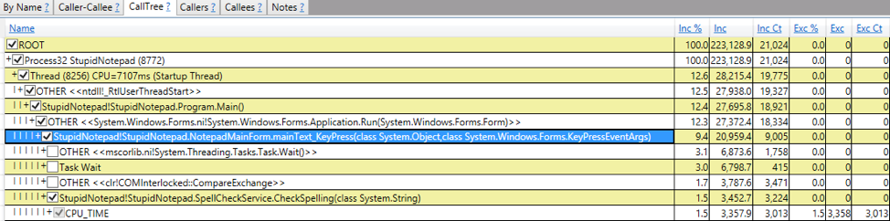

### Diagnosting Slow Performance

In this lab, you will use PerfView to profile the CPU utilization and overall performance of a .NET application.

Run the **StupidNotepad\Binaries\StupidNotepad.exe** application and start typing some text into the edit box. You’ll notice that the UI occasionally stutters and stops responding for short periods of time.

Run **PerfView.exe** and select **Collect** > **Run** from the menu. Specify the full path to the **StupidNotepad\Binaries\StupidNotepad.exe** application. Make sure to check the **Thread Time** checkbox before clicking **Run**.

When the application opens, type some text again. Make sure the UI hiccup occurs multiple times, and then close the application and go back to PerfView.

In PerfView, double-click the generated .etl file and choose the **Thread Time (with Tasks) Stacks** report. In the resulting window, go to the **CallTree** tab and expand the **StupidNotepad** process and the main (startup) thread. Click the checkboxes to expand the view until you reach the `MainForm.mainText_KeyPress` event handler, which spends quite a bit of CPU time and waits for a task.

If you see frames with unresolved symbols (?!?), right-click the frame and select **Lookup Symbols** to resolve them. You can also experiment with command line shortcuts: Alt+S to lookup symbols, Alt+M to fold, and so forth.
