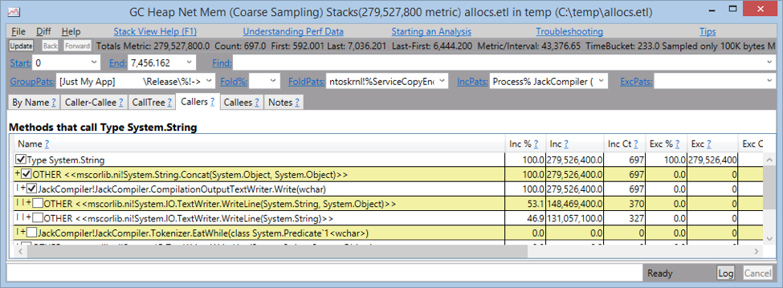

### Diagnosing Excessive Allocations

In this lab, you will use PerfView to determine why a .NET application is causing lots of garbage collections and allocating a large amount of memory.

#### Task 1

Open a command prompt and navigate to the **JackCompiler\Binaries** folder. Run the following command:

```
JackCompiler.exe BigProgram.jack
```

Make note of the size of BigProgram.jack – it is under 500KB, but it still takes the **JackCompiler.exe** a very long time to compile it. Do not terminate the program. You will now use PerfView to determine why the compiler is misbehaving.

#### Task 2

Run **PerfView.exe** and choose **Collect** > **Collect** from the menu. Make sure to check the **.NET SampAlloc** checkbox. When you’re done, click **Start Collection**.

After a few seconds, click **Stop Collection** and open the report in PerfView’s left pane. Double-click the **CPU Stacks** report, choose the **JackCompiler** process, and notice which methods are responsible for the highest CPU utilization.

Next, go back to the report file in PerfView’s left pane and double-click the **GC Heap Net Mem (Coarse Sampling) Stacks** report. Choose the **JackCompiler** process again. In the **By Name** tab, notice that the application is allocating mostly strings. Double-click the **String** row and expand the call tree until you determine which call path is responsible for most allocations.


 
#### Task 3 (Optional)

Fix the application code (under **JackCompiler\Sources**) to avoid excessive allocations in this code path, and then measure it again. You should see a gigantic performance improvement.

*Hint: Replace the `CompilationOutputTextWriter` with a simple `StringWriter`.*
