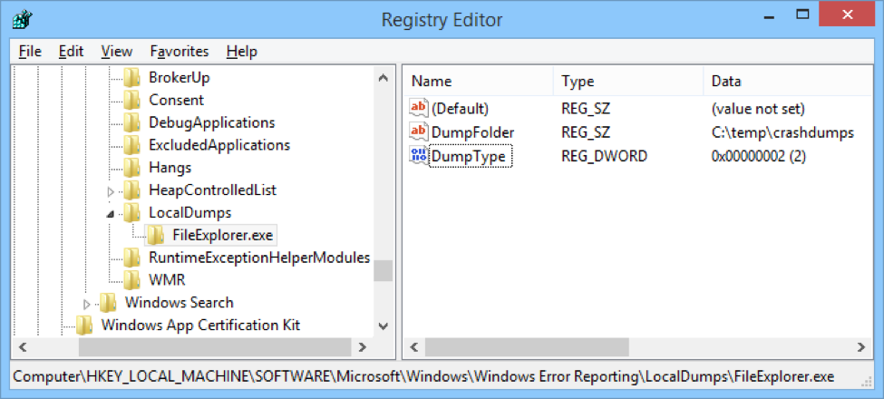
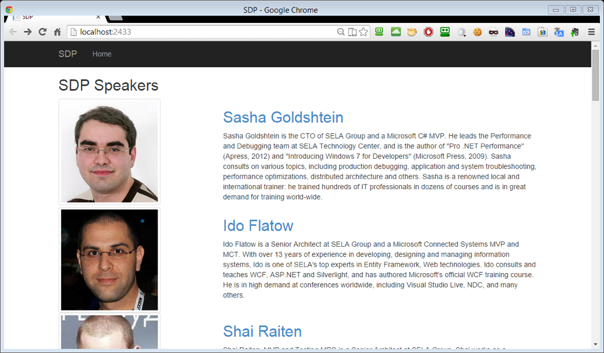

### Automatic Dump Generation

In this lab, you will configure Windows Error Reporting and DebugDiag to generate dumps automatically when a specific application crashes. Then, you will analyze the resulting dumps using Visual Studio and WinDbg.

#### Task 1

Navigate to the registry key **HKEY_LOCAL_MACHINE\SOFTWARE\Microsoft\Windows\Windows Error Reporting\LocalDumps**. If the LocalDumps key doesn’t exist, create it. Under the **LocalDumps** registry key, create another key called **FileExplorer.exe**.

Under the **FileExplorer.exe** key, create the following values:

* **DumpFolder** of type REG_SZ (string) with the value **C:\Temp\CrashDumps**
* **DumpType** of type REG_DWORD with the value **2**
 


Run the **FileExplorer\Binaries\FileExplorer.exe** application. It crashes after a few seconds without ever initializing properly. Navigate to the **C:\Temp\CrashDumps** folder and make sure a dump file was created.

#### Task 2

Open Visual Studio and drag the dump file onto its surface. Visual Studio should open a **Minidump File Summary** window with some basic information about the dump.

Click the **Set Symbol Paths** link on the top right of the window, and add the full path to the **FileExplorer\Binaries** folder. Visual Studio will then use this path to locate the application’s symbols.

When ready, click **Debug with Managed Only**. If prompted for the location of the source code, provide the path to the **FileExplorer\Sources\FileExplorer** folder.

At this point, you should see the exact exception that occurred in the application. You can review the call stack, local variables, other threads, and the application’s source code until you are confident why the exception occurred and how to fix the issue.

#### Task 3

Run WinDbg from the Windows SDK installation directory. You need the 32-bit version of WinDbg, which on a typical system will reside in **C:\Program Files (x86)\Windows Kits\10\Debuggers\x86\windbg.exe**.

Click **File** > **Symbol File Path** and make sure the path consists of two parts, separated by a semicolon:

```
srv*C:\symbols*http://msdl.microsoft.com/download/symbols;Path_To_FileExplorer\Binaries
```

Drag the dump file onto the WinDbg surface. In the command window on the bottom, issue the following commands:

```
.loadby sos clr
!PrintException
```

The debugger should then print the details and the call stack of the exception that occurred in the application. To see source-level information (source file name and line number) and additional data on parameters and local variables, issue the following commands:

```
.load Path_To_FileExplorer\Binaries\sosex.dll
!mk -a
```

Feel free to experiment with the hyperlinks: clicking a hyperlink next to a parameter or local variable will provide some additional information about that object, similar to hovering over a variable in Visual Studio.

#### Task 4

Open the **SDPApp\SDPApp.sln** solution in Visual Studio. Build and run the web application and make sure it displays a list of conference speakers.



> The rest of the lab assumes are you using IIS Express, which is the Visual Studio default web server, but it’s also OK if you deploy the application to a full IIS instance.

#### Task 5

From the Start menu, run **DebugDiag 2.0 Collection**. Use the wizard to create a new crash rule. In the target type selection dialog, pick **A specific process** and on the next screen select the **iisexpress.exe** process. (If you deployed the application to a full IIS instance, you should pick the appropriate **w3wp.exe** process, or pick All IIS/COM+ related processes on the previous screen.)

In the **Advanced Settings** section, click **Exceptions** and then click **Add Exception**. Select **CLR (.NET) 4.x Exception** and in the exception type textbox type `System.ApplicationException`. In the action type dropdown select **Full Userdump**.

After you save all configuration settings, DebugDiag will monitor the web application and generate a dump file when an `ApplicationException` object is thrown.

#### Task 6

Click the **Sasha Goldshtein** link in the web application. An error message is displayed. Behind the scenes, an application was thrown but the web application doesn’t display error specifics (which is the right behavior for a production service).

Go back to the DebugDiag window and make sure the **Userdump Count** column indicates there is at least 1 dump.

Open the Start menu and run **DebugDiag 2.0 Analysis**. Check the **Crash/Hang Analysis** checkbox, and click **Add Data Files** on the bottom of the screen. Navigate to the folder where the dump file was generated (by default it should be under **C:\Program Files\DebugDiag\Logs\YOUR RULE NAME**), and select the dump file. Then, click **Start Analysis**.

Review the analysis report and make sure you see the precise exception stack trace and understand where to look next to determine what caused the error.
